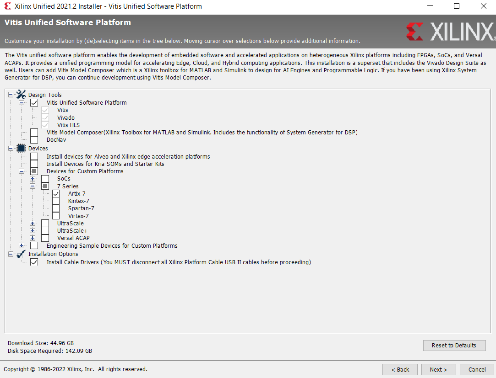
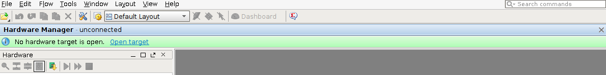

# Embedded Systems — Homelab Instructions  
**Task 1 – Install the tools and Getting Started with the Board (ARTY)**

## Before Start: Preparation

The homelab consists of:
- Simulation tasks (can be done independently at any time)
- Synthesis tasks (also independent of hardware access)
- Test on FPGA board (requires booking the development board)

You do not need a development board to perform simulation and synthesis steps.  
Only testing on hardware requires temporary access to the FPGA board.

## Simulation Part

- You can carry out the simulation tasks on your machine without the need for hardware.
- These simulations help verify your logic design before implementation.

## Synthesis Part

- You can perform synthesis anytime.
- It generates the bitstream needed to program the FPGA but does not require the board.

## Task Execution Flow

You are free to:
- Book the board right away, if you want to start testing early.
- Complete all simulation and synthesis tasks first, then reserve the board.
- Note: The board is loaned for one week only.

## Test on the Board

To test your design on the board:

1. Reserve a board through this form:  
   [https://forms.gle/2wnSufaGNXtGokuZ7](https://forms.gle/2wnSufaGNXtGokuZ7)

2. After submitting the form, you’ll be contacted by **Giacomo Valente** to arrange a pick-up time.

3. From the day of collection, you have 7 days to test the board.

4. On the day of return, you’ll be asked questions about your work.

5. At the final Embedded Systems exam, the professor will verify if the homelab was completed.

## Vivado & Vitis Design Suite - Installation

Download and install **Vitis Unified Software Platform** from:  
[https://www.xilinx.com/support/download.html](https://www.xilinx.com/support/download.html)

- Install via Web Installer.
- Choose "Vitis installation", which includes Vivado and other tools.
- Make sure the version is compatible with your OS (see release notes).
- Alternatively, install on a Virtual Machine (e.g., VirtualBox) if needed.
- You need to register on the Xilinx site to download.
- Allocate sufficient disk space (~150 GB recommended).

### Installation Notes

During installation, deselect unnecessary platforms and boards as shown below:

*Note: Screenshots may vary slightly depending on version.*

## ARTY Board Setup

Before using the board:

1. Check jumper settings as per the Reference Manual [RM](https://digilent.com/reference/programmable-logic/arty/reference-manual?srsltid=AfmBOorQAp5OIsSD9wbm5TuxVOrW_Wv5l9VriFXxj8XVjFVsnrwK8nJw).  
   Jumpers control power and I/O routing — incorrect settings can damage the board.

2. Jumpers must be set to enable JTAG connection.

3. Avoid placing the board on conductive surfaces.

4. Follow Digilent’s guide to install ARTY board files in Vivado:  
   [https://digilent.com/reference/programmable-logic/guides/installing-vivado-and-vitis](https://digilent.com/reference/programmable-logic/guides/installing-vivado-and-vitis)

## Board ↔ PC Communication Test

1. Connect the board to your PC using a USB cable (it will power on automatically).
2. Open Vivado and launch the Hardware Manager.
3. Click on Open Target → Auto Connect.

You should see your board recognized:

