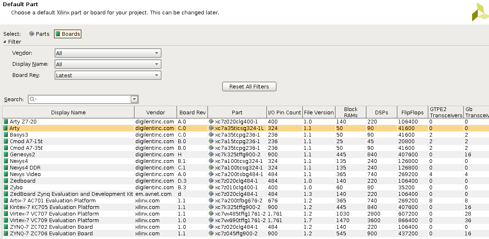
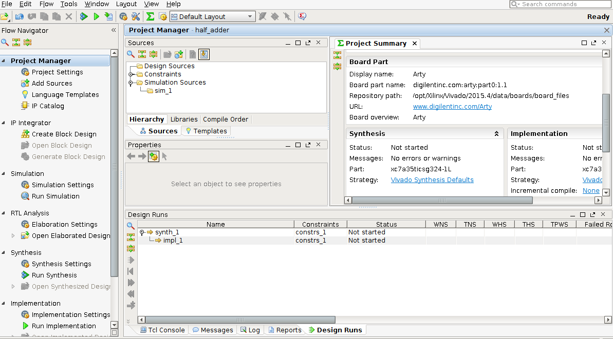
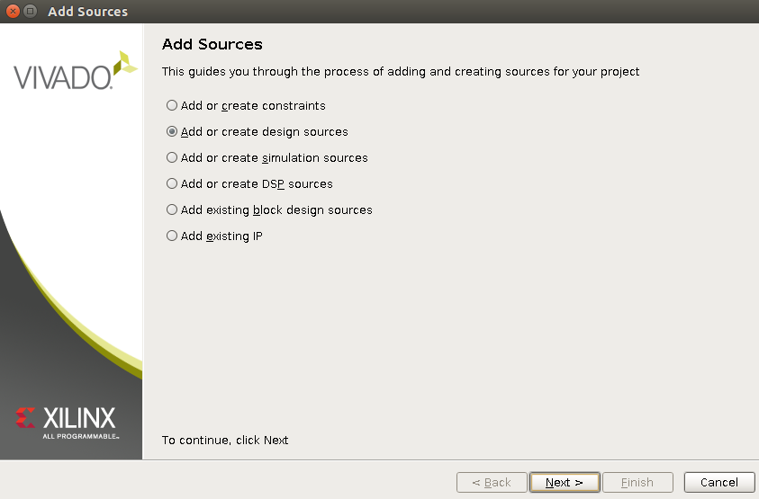
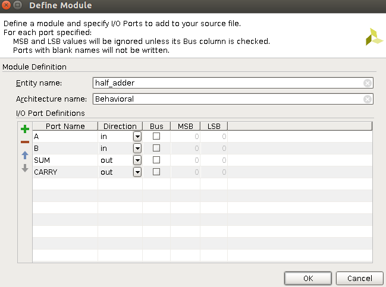
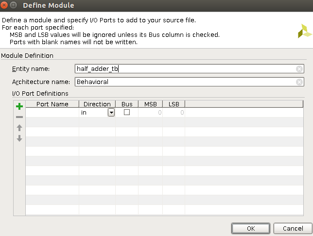
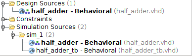
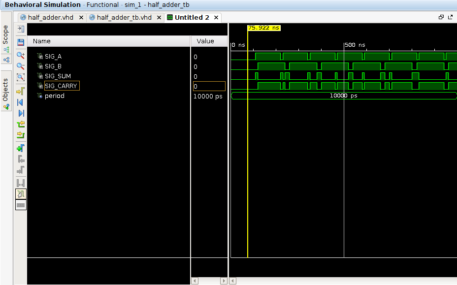

## Task 2: Simulation and Synthesis of Simple Combinatorial Circuits

This section explains how to use the Vivado Design Suite for the simulation and synthesis of a simple digital circuit: the **half adder**.

### 1.1 – VHDL Description of Half Adder

The creation of a new project in Vivado and description of the half-adder follows these steps:

* Launch Vivado
* Select **Create New Project** from the icons
* Click **Next** and specify the project name and location (avoid spaces in folder names)
* Click **Next**, then select **RTL Project**
* Click **Next**, select **VHDL Language** and **Mixed simulator**
* Do not add sources, IP, or constraints for now. Click **Next** until the board selection step
* Select the **ARTY** board from the list and click **Next**



* Review the settings and click **Finish**

You will see the following screen:



**Vivado GUI Overview**:

* **Source Window** (top): contains design and simulation source files
* **Flow Navigator** (left): steps like Simulation, Synthesis, etc.

Add source files:

* Right-click the source window and select **Add Sources**
* Select **Add or create design sources** and click **Next**
* Click the green **+** and create a new file (e.g., `half_adder.vhd`)



Fill out the module definition as shown below:



Complete the architecture section with the following code:

```vhdl
ARCHITECTURE Behavioral OF half_adder IS
BEGIN
  SUM <= A xor B;
  CARRY <= A and B;
END Behavioral;
```

This completes the half adder description. Save the file.

### 1.2 - Simulation

To verify the correctness of the module, we need to run a **Behavioral Simulation**:

1. Add a new source file (testbench): **Add or create simulation sources**



Do not insert ports (it's a testbench).

2. In the Source window, select the testbench file under **Simulation Sources**:



3. Add stimuli processes, for example:

```vhdl
A_stim_proc: process
begin
  wait for 100 ns;
  SIG_A <= '0';
  wait for period;
  SIG_A <= '1';
  wait for period;
end process;

B_stim_proc: process
begin
  wait for 100 ns;
  SIG_B <= '0';
  wait for 2*period;
  SIG_B <= '1';
  wait for 2*period;
end process;
```

4. In the Flow Navigator, open **Simulation Settings**:

* Check **Vivado Simulator** is selected
* Set the correct **Top Module** (the testbench)
* Set **Simulation Runtime**

Then select **Run Simulation** > **Run Behavioral Simulation**.

This will open **XSim**, which shows the simulation waveform:



Verify that the output values match the expected truth table for a half adder.

### 1.3 - Synthesis

1. Close the XSim simulator
2. In the Flow Navigator, select the `half_adder` module
3. Click **Run Synthesis**

After synthesis:

* You may open reports
* View synthesized design
* Proceed to **Run Implementation** if desired

### 1.4 - TODO

Study and simulate the VHDL descriptions of the following components (available in the `hw/` folder of the repository):

* **FullAdder**
* **mux4to1**
* **mux8to1**
* **D-Flip Flop (DFF)**
* **PIPO register**
* **GCD calculator**

Verify that each module works as expected. If testbench is missing for some modules, develop it and simulate the module.

#### Final Task:

Develop a testbench to test the **GCD module** using the FSM + datapath style. Verify its correctness through simulation.


