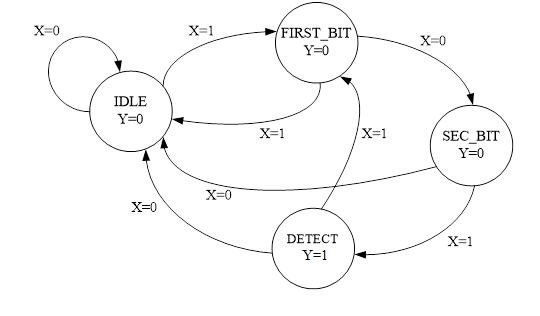

## Task 4: Sequence Detector (Finite State Machines - FSM)

In this section, it will be illustrated how to implement a circuit able to detect an exact binary sequence on the input line. Suppose that a synchronous detector has to be implemented, therefore a data input line (`X`) and a clock signal are expected as inputs: data will then be read at the rising edge of the clock. The output (`Y`) will be equal to 1 only when the sequence is detected.

Using the HDL for system description, XDC for constraints, and Vivado Design Suite for implementation, the task is to implement a system that solves the problem and to verify the functionality using two switches to emulate, respectively, the clock signal and the input signal.

The following state diagram describes a sequence detector in which the detected word on the serial port (`101`) is hardcoded.

A draft of VHDL code for a Finite State Machine (Moore type — i.e., the output is determined only by the current machine state, and the next machine state is determined by the input and the current machine state) that implements the behavior of the previous diagram is provided within the `hw` repository folder.

The definition of an enumerated data type is convenient for the state representation.

Note: You need to complete the project by assigning an `.xdc` file to specify the correct connection between:

- Sequence detector ports
- Board LEDs (for output Y)
- Board switches (for clock and input X)

You can then perform the FPGA configuration in the same way as in the previous task.

### Todo

- Simulate the system using a testbench and verify its behavior.
- Synthesize and implement the design on the FPGA.
- Verify that it works on the board by toggling the input and clock switches and observing the output on the LED.

